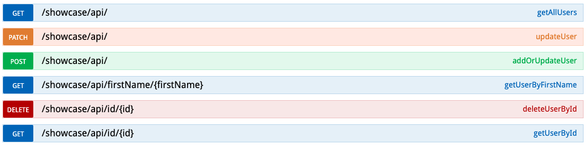

#
# CRUD MongoDB using Spring Boot 

This Application exposes endpoint to GET/POST/PATCH/DELETE into Cloud MongoDB.

This project is built in Spring Boot and connect to Cloud MongoDB and allows you to get, add, update or delete User details.

The project also have enabled SWAGGER to interact with the user.

## This Project covers below
* Spring Boot
* JPA connection to MongoDB
* Control Advice
* Basic Authorization
* Swagger

## To DO

* JUnit
* Docker Build
* Code Clean Up

## Running the application locally

Below are the steps to run the scripts locally.

    $ git clone https://github.com/IRasmivan/spring-boot-mongodb
    $ cd spring-boot-mongodb
    $ mvn spring-boot:run
 
The above steps should start the Spring Boot Application.

Open your browser and navigate to the link which should openup Swagger endpoint for this application.

    URL: http://localhost:8080/swagger-ui.html#/user-controller

## Project Structure
This project holds the below folder structure

    .
    .
    ├── src
    │   └── main
    │       └── java
    │           ├── com.rasmivan.showcase
    |           ├── com.rasmivan.showcase.advice
    |           ├── com.rasmivan.showcase.config
    │           ├── com.rasmivan.showcase.constants
    │           ├── com.rasmivan.showcase.controller
    │           ├── com.rasmivan.showcase.domain
    │           ├── com.rasmivan.showcase.dto
    │           ├── com.rasmivan.showcase.exception
    │           ├── com.rasmivan.showcase.repositories
    │           ├── com.rasmivan.showcase.security
    │           └── com.rasmivan.showcase.service
    .
    .
    
 
### Controller
Spring Boot application exposes 6 endpoint below.

# 
